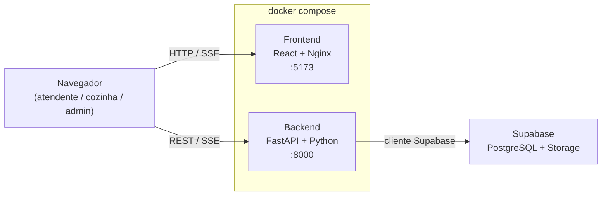

# ☕ Café Teria — Sistema de PDV

Sistema de Ponto de Venda (PDV) para cafeteria, desenvolvido como trabalho final
da disciplina de Arquitetura e Projeto de Software.

O projeto demonstra na prática a aplicação de **Clean Architecture**, princípios
**SOLID**, seis padrões de projeto **GoF**, **TDD**, **BDD** e uma arquitetura de
**microsserviços** containerizada — integrados em um sistema funcional com
frontend React, backend FastAPI e banco de dados PostgreSQL na nuvem.

**Sistema em produção:**
- Frontend: https://pdv-cafeteria-cafe-teria.onrender.com
- Backend: https://cefeteria-cafe-teria.onrender.com

---

## 🏗️ Arquitetura

```
cafeteria_patterns/
├── backend/
│   ├── api/              # Camada de Apresentação (FastAPI + Pydantic)
│   ├── use_cases/        # Camada de Aplicação (orquestração das regras)
│   ├── domain/           # Núcleo — entidades e padrões GoF
│   │   ├── itens/        # Entidade base e ItemDinamico
│   │   ├── decorators/   # Padrão Decorator (adicionais e tamanhos)
│   │   ├── factories/    # Padrão Factory (instanciação data-driven)
│   │   ├── fechamento_conta/ # Padrão Strategy (formas de pagamento)
│   │   ├── pedido/       # Padrão Command (carrinho com undo)
│   │   ├── cozinha/      # Padrão Singleton (fila única)
│   │   ├── observers/    # Padrão Observer (status do pedido)
│   │   └── interfaces/   # Contratos abstratos (DIP)
│   └── infra/            # Detalhes externos (Supabase, repositórios)
├── frontend/             # SPA React + Vite + Tailwind CSS v4
│   ├── Dockerfile        # Build do React + Nginx
│   └── nginx.conf        # Roteamento SPA (React Router)
├── db/
│   ├── schema.sql        # Criação das tabelas
│   └── seed.sql          # Dados mockados para rodar localmente
├── tests/                # Testes unitários (pytest/unittest)
├── features/             # Testes de comportamento BDD (Gherkin/behave)
├── admin.py              # CLI do gerente (rich)
├── main.py               # CLI de demonstração dos padrões
├── Dockerfile            # Containerização do backend
└── docker-compose.yml    # Orquestra frontend + backend juntos
```

---

## 🎯 Padrões de Projeto Aplicados

### Factory Method — `backend/domain/factories/item_factory.py`
Instancia produtos dinamicamente a partir do banco de dados. Novos produtos
são adicionados pelo gerente via `admin.py` sem nenhuma alteração no código
— respeita o princípio **Open/Closed (OCP)**.

### Decorator — `backend/domain/decorators/adicionais.py`
Envolve um item com adicionais (leite, chantilly) e tamanhos (médio, grande)
de forma recursiva e em tempo de execução. Elimina a explosão de subclasses
que ocorreria com herança.

### Command — `backend/domain/pedido/carrinho.py`
Encapsula cada ação do carrinho como um objeto com `executar()` e `desfazer()`.
Habilita o histórico de ações e o comportamento de desfazer itens inseridos
erroneamente.

### Strategy — `backend/domain/fechamento_conta/strategy.py`
Cada forma de pagamento (Pix, Cartão, Dinheiro) é uma estratégia intercambiável
que sabe processar a si mesma. Elimina blocos `if/else` no controlador e
permite adicionar novos métodos de pagamento sem alterar o código existente.

### Singleton — `backend/domain/cozinha/fila_pedidos.py`
Garante que existe apenas uma fila de pedidos na memória da aplicação.
Múltiplos atendentes alimentam a mesma fila centralizada acessada pela cozinha.

### Observer — `backend/domain/observers/observer.py`
Define o contrato para notificação de mudanças de status do pedido.
`GerenciadorPreparo` notifica todos os observadores inscritos ao mudar o status.
No contexto web, o `SSEManager` aplica o mesmo padrão para empurrar atualizações
em tempo real ao PDV e à Cozinha.

---

## 🧩 Arquitetura de Microsserviços

O Café Teria é composto por **dois serviços independentes** que rodam em
contêineres separados e se comunicam exclusivamente pela rede, via
**HTTP/REST** e **Server-Sent Events (SSE)**:

- **Frontend** — React + Vite, servido por Nginx. Responsável apenas pela
  interface (PDV, Cozinha, Admin). Não acessa banco diretamente.
- **Backend** — FastAPI + Python. Concentra regras de negócio, padrões GoF,
  persistência e a fila da cozinha. Expõe a API REST e o stream SSE.

Cada serviço tem seu próprio `Dockerfile`, sobe de forma isolada e pode ser
escalado ou implantado de forma independente — características centrais de uma
arquitetura de microsserviços. O `docker-compose.yml` orquestra os dois com um
único comando.



> **Nota de transparência (banco de dados):** numa abordagem estrita de
> microsserviços, cada serviço teria seu próprio banco ("database per
> service"). Aqui optamos conscientemente por um **único Supabase
> compartilhado** entre os domínios de `produtos` e `pedidos`, por dois motivos
> no escopo deste trabalho: (1) simplicidade operacional e custo zero de
> infraestrutura no Render, e (2) o backend é um único serviço, então não há
> acoplamento entre serviços distintos pelo banco. A evolução natural seria
> separar `produtos` e `pedidos` em serviços próprios, cada um com seu banco —
> deixamos isso documentado como próximo passo arquitetural.

---

## 🗄️ Banco de dados

O sistema usa **PostgreSQL** (hospedado no Supabase). São apenas duas tabelas.

### Tabela `produtos`
O catálogo. O `ItemFactory` lê esta tabela e instancia os itens em runtime.

| Campo | Tipo | Observação |
|---|---|---|
| `id` | uuid | PK (gerada automaticamente) |
| `nome` | text | Sempre em minúsculo |
| `preco` | numeric(10,2) | |
| `categoria` | text | `cafe` / `suco` / `comida` / `adicional_cafe` / `adicional_suco` / `adicional_tamanho` |
| `imagem_url` | text | Nullable — URL do Supabase Storage |

### Tabela `pedidos`
Os pedidos pagos. O `status` acompanha o fluxo da cozinha.

| Campo | Tipo | Observação |
|---|---|---|
| `id` | uuid | PK (gerada automaticamente) |
| `nome_cliente` | text | Ex: "Mesa 07" |
| `item_preparado` | text | Nomes separados por ` \| ` |
| `total_pago` | numeric(10,2) | |
| `metodo_pagamento` | text | `pix` / `cartao` / `dinheiro` |
| `status` | text | Ver fluxo abaixo |
| `criado_em` | timestamptz | |

**Fluxo de status:** `Na fila da cozinha` → `Em preparo` → `Pronto` → `Entregue`

### Criação e dados mockados

Os scripts em `db/` criam as tabelas e populam o sistema com um catálogo
completo e alguns pedidos em status variados — assim a tela da Cozinha já abre
com conteúdo. Há dois caminhos para usá-los.

> ℹ️ O backend usa o **cliente do Supabase** (`create_client()`), que conversa
> com as APIs REST/Auth/Storage — **não** é uma conexão Postgres direta. Por
> isso não basta subir um contêiner `postgres` avulso: use um dos dois caminhos
> abaixo, que entregam a stack Supabase completa.

#### Caminho 1 — Supabase na nuvem (recomendado, mais simples)

1. Crie um projeto gratuito em [supabase.com](https://supabase.com).
2. No **SQL Editor**, cole e rode o conteúdo de `db/schema.sql`.
3. Em seguida, cole e rode o conteúdo de `db/seed.sql`.
4. Em **Project Settings → API**, copie a **Project URL** e a **anon key** para
   o seu `.env`:

```env
SUPABASE_URL=https://SEU-PROJETO.supabase.co
SUPABASE_KEY=sua_anon_key_aqui
```

5. (Opcional) Para upload de imagens, crie um bucket público chamado
   `imagens-produtos` em **Storage**. Sem ele, os produtos exibem o
   placeholder padrão.

#### Caminho 2 — 100% local com um comando (Supabase CLI)

Sobe a stack Supabase inteira (Postgres + REST + Auth + Storage) na sua máquina
via Docker, sem precisar de conta na nuvem.

```bash
# 1. Instale a CLI (escolha conforme seu sistema)
npm install -g supabase        # ou: scoop install supabase / brew install supabase

# 2. Inicialize e aponte os scripts SQL
supabase init
cp db/schema.sql supabase/migrations/0001_init.sql
cp db/seed.sql   supabase/seed.sql

# 3. Suba tudo (Docker precisa estar rodando)
supabase start

# 4. Aplique schema + seed
supabase db reset
```

Ao final, `supabase start` imprime a **API URL** e a **anon key** locais —
use-as no `.env` do backend.

---

## ⚙️ Como rodar

### Opção A — Docker Compose (sobe tudo de uma vez)

Com o arquivo `.env` configurado na raiz (ver seção do banco de dados):

```bash
docker compose up --build

# Frontend:  http://localhost:5173
# Backend:   http://localhost:8000/docs

# Para encerrar:
docker compose down
```

### Opção B — Manualmente (desenvolvimento)

#### Pré-requisitos
- Python 3.11+
- Node.js 18+
- Banco de dados configurado (ver seção acima)

#### Backend

```bash
# 1. Crie e ative o ambiente virtual
python -m venv venv
venv\Scripts\activate       # Windows
source venv/bin/activate    # Linux/Mac

# 2. Instale as dependências
pip install -r requirements.txt

# 3. Configure o .env na raiz (SUPABASE_URL, SUPABASE_KEY)

# 4. Suba o servidor
uvicorn backend.api.rotas:app --reload
```

#### Frontend

```bash
cd frontend
npm install
npm run dev
```

#### Painel do gerente (CLI)

```bash
python admin.py
```

---

## 🧪 Testes

```bash
# Todos os testes unitários
pytest -v

# Apenas um módulo
pytest tests/test_domain.py -v
pytest tests/test_cozinha.py -v

# Testes de comportamento BDD
behave features/pedido.feature
```

**Cobertura atual: 17 testes unitários + 1 cenário BDD**

| Arquivo | Testes | O que cobre |
|---|---|---|
| `test_domain.py` | 9 | Decorator (nome, preço, empilhamento) + Strategy (3 métodos + intercambialidade) |
| `test_cozinha.py` | 6 | Singleton (instância única) + Fila FIFO (ordem, remoção, fila vazia) |
| `test_api.py` | 2 | Rota `/pedidos/pagar` (PIX + envio para cozinha) |
| `pedido.feature` | 1 | Montagem de pedido com adicional via BDD |

---

## 🚀 Deploy

O sistema está publicado no **Render.com** com deploy automático a cada push
na branch `main`. As variáveis de ambiente (`SUPABASE_URL`, `SUPABASE_KEY`,
`FRONTEND_URL` no backend; `VITE_API_URL` no frontend) são configuradas no
painel do Render.

---

## 🏛️ Decisões arquiteturais relevantes

**Por que Clean Architecture?**
Isola as regras de negócio (domínio) de detalhes de implementação (FastAPI,
Supabase). O domínio não importa nada de `infra/` — a dependência flui sempre
de fora para dentro.

**Por que o Factory é data-driven?**
Em vez de uma classe por produto, o `ItemFactory` consulta o banco e instancia
um `ItemDinamico` em tempo de execução. O gerente cadastra novos produtos via
`admin.py` sem o programador precisar alterar uma linha de código.

**Por que Decorator para tamanhos?**
Tamanho é um adicional de preço como qualquer outro. Tratar como Decorator
elimina a necessidade de classes como `CappuccinoGrande` ou
`EspressoMedioComLeite` — a combinação acontece em runtime.

**Por que `VITE_API_URL` é um build arg no Docker?**
O Vite injeta variáveis de ambiente em *build time*, não em runtime. Além disso,
quem consome a API é o navegador (no host), que não enxerga o hostname interno
`backend` da rede Docker. Por isso o `docker-compose.yml` passa
`VITE_API_URL=http://localhost:8000` como argumento de build do frontend.

**Limitação conhecida do Singleton em produção:**
A `FilaDePedidosDaCozinha` garante instância única dentro de um processo Python.
Com múltiplos workers, cada processo teria sua própria fila. O servidor está
configurado com um único worker (`--workers 1`) até que a fila seja migrada
para persistência no banco.